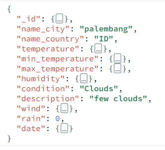

# AeroCast_API

A simple weather application with MongoDB as the database.

## Description

This application allows users to view weather data based on city and country. Weather data is stored in MongoDB without requiring a login system.

## Features

- View weather data based on city and country.
- Add and searching cities.

## Technologies Used

- Programming Language: Go
- Database: MongoDB
- Framework: Echo

## Run Locally

Clone the project

```bash
git clone https://github.com/fauzibrillian/AeroCast_API.git
```

Go to the project directory

```bash
cd AeroCast_API
```

Install dependency

```bash
go mod tidy
```

## KEY VALUE


## API

<summary>City</summary> 
<div>
  
| Feature User | Endpoint | Param | Function |
| --- | --- | --- | --- |
| GET | /city | NameCity or NameCountry | + | Get and Search all city. |
| POST | /city  | - | + | Post city data. |


</details>

<div>
